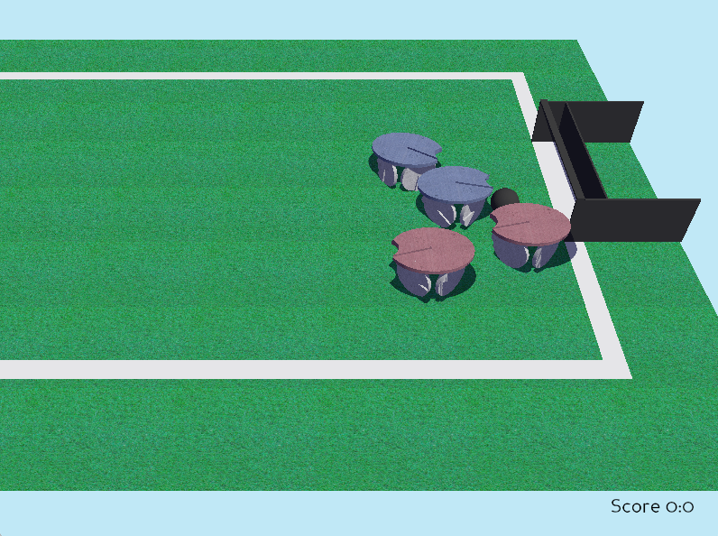

# RobocupSoccer

What it is
==========
3D physical simulation of robocup soccer 4 wheeled robots (with omni-wheels)

How to run
==========
Pre-requesists: Panda3D at 
<https://www.panda3d.org/>

python soccer.py

Test your robot code
====================
robotPrg1A.py: code for robot #1 in team A

robotPrg2A.py: code for robot #2 in team A

robotPrg1B.py: code for robot #1 in team B

robotPrg2B.py: code for robot #2 in team B

The code is designed to run pybrick or lego Prime legacy python code
